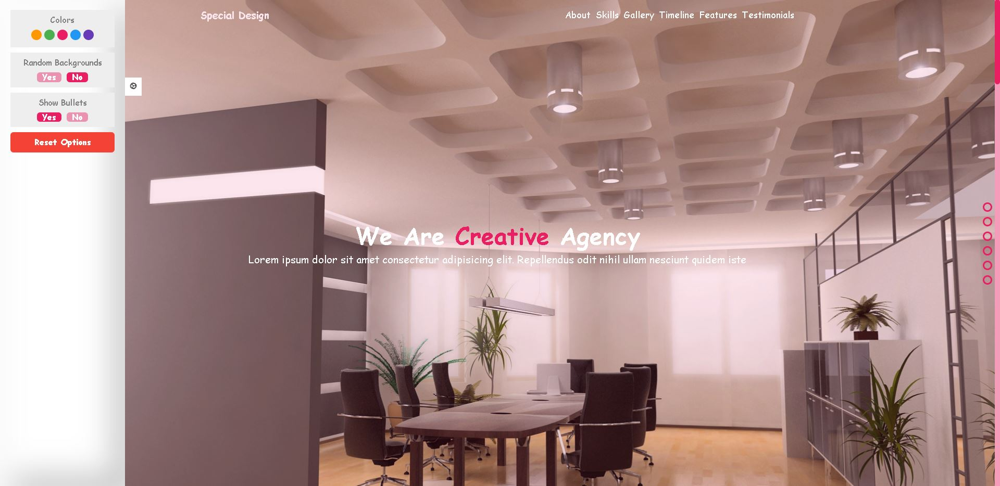

# <a>🏛️Special-Template</a>

<h3>Special Design --Practice JS Template </h3>

<menu>
  <li>A Practice Design Template, Mainly Focused on practical Javascript.</li>
  <li>LocalStorage To Save User Settings, and take defaults when reload.</li>
  <li>Randomly Change Background images at time intervals.</li>
  <li>Validation System of Form Fully functioning.</li>
  <li>Custom Setting Panel on Sticky Position.</li>
  <li>Changes on Widths|Display On Scroll.</li>
  <li>Popup menu on image click.</li>
  <li>Animated SVG</li>
  <li>Grid System</li>
</menu>

# Special Design

<pre>
1st Day: 6/2/2022
first Dev session:      06:20 AM    ~   08:44 AM        ~ 02h 24m

2nd Day: 7/2/2022
first Dev session:     08:11 AM    ~   12:34 PM        ~ 04h 23m

3nd Day: 8/2/2022
first Dev session:      07:24 AM    ~   03:03 PM        ~ 07h 39m
</pre>

<pre><q>Challenge Completed in   16h 26m</q></pre>

 
 
 

    
Website Stats Report

    

 
 

    
Website UPDATED Stats Report

    

 
 

TODO:

- [x] zoom effect on hover in gallery section
- [x] on scroll show time line smoothly
- [x] Timeline final touches
- [x] Features functionility
- [x] testimonials
- [x] Contact us
- [x] Footer
- [x] Contact us Form function.js
- [x] popup for unvalid data
- [x] delete the popup span on evetlistener vaild data 🎉🎉🎉
- [x] preview image
- [x] Stats image
- [x] if empty Storage => set buttons in gearBox to defualt actives
- [x] level up Accessibility
- [x] level up SEO
- [x] level up Best Practices
- [x] check responsivity of the lower part of the webpage
- FIXDONE: the condition to let the backgrounds chnage randomly
- FIXDONE: Fix Popup image size
- FIXDONE: disable selecting text on bullets

   
   
   
  🍬 Leave a :star:&nbsp;if you like it, Please!🤩

 

📫 Please hit me up at mohammed.yuossry@gmail.com if you have any feedback or improvements.
