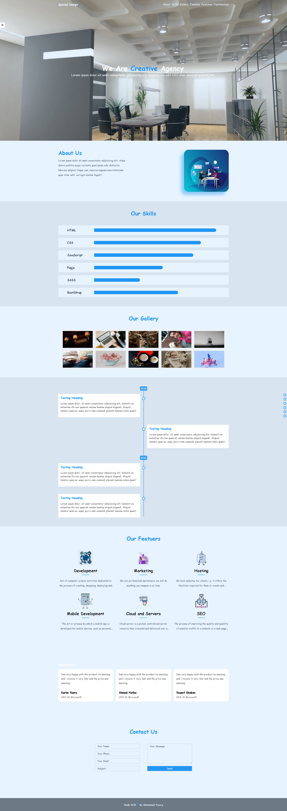

# <a>🌇Special-Template</a>

<h3>Special Design --Practice JS Template</h3>

# Special Design

<pre>
1st Day: 6/2/2022
first Dev session:      06:20 AM    ~   08:44 AM        ~ 02h 24m

2nd Day: 7/2/2022
first Dev session:     05:11 AM    ~   12:34 PM        ~ 07h 23m

3nd Day: 8/2/2022
first Dev session:      07:24 AM    ~   03:03 PM        ~ 07h 39m
</pre>

<pre><q>Challenge Completed in   19h 26m</q></pre>

 
 

<h3> Website Stats Report</h3>

 
 
 

TODO:

- [x] zoom effect on hover in gallery section
- [x] on scroll show time line smoothly
- [x] Timeline final touches
- [x] Features functionility
- [x] testimonials
- [x] Contact us
- [x] Footer
- [x] Contact us Form function.js
- [x] popup for unvalid data
- [ ] delete the span on evetlistener vaild data

 
 
 
🍬 Please Leave a :star: &nbsp;if you like it, Please!🤩

 

📫 Please hit me up at mohammed.yuossry@gmail.com if you have any feedback or improvements.
